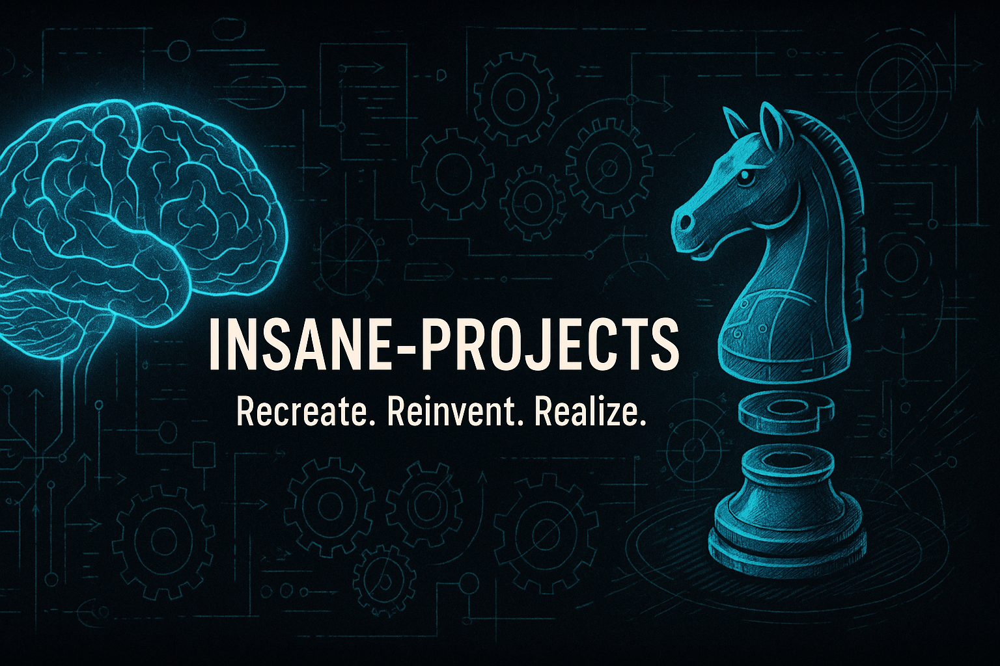

# 🧠 INSANE-PROJECTS

Welcome to **INSANE-PROJECTS** – a repository where logic meets madness.

This is not just a collection of complex, high-effort builds — it’s a **journey into the core of systems**, where the goal is to **recreate the wheel** to understand how it turns.

Every project here is a deep dive, built from the ground up — **no shortcuts, no libraries doing the heavy lifting** — just raw logic and core fundamentals.

---

## 🔍 Philosophy

> **“Reinvent the wheel — not because it hasn’t been done before, but to understand how it *actually* rolls.”**

In an era of abstraction and convenience, this repo is a **return to the roots**:

* Build everything yourself
* Understand every layer
* Explore insane depths of logic and structure

---

## 🚀 Projects

### ♟️ Chess-engine

An AI-powered chess engine written from scratch.
This project is a classic “reinvent-the-wheel” attempt to understand the **inner workings of a real game engine**.

#### What It Covers:

* Move generation and validation
* Search algorithms (Minimax + Alpha-Beta pruning)
* Evaluation heuristics
* Game loop, board state, and undo/redo logic
* FEN parsing and future GUI/bitboard upgrades

> **Status:** 🟢 In Development
> **Goal:** Learn by building every piece of the logic manually
> **Language:** Python/C++ (flexible)

---

## 🧪 Coming Soon (Planned Projects)

| Project Name   | Description                                                  | Status     |
| -------------- | ------------------------------------------------------------ | ---------- |
|  NeuroSim    | A biological neuron simulator for spiking neural networks    | 🚧 Planned |
|  LockCrack   | A trial-and-error based AI for digital lock simulation       | 🚧 Planned |
|  Game-Bot    | Game AI that learns to play by observing screen input        | 🚧 Planned |
|  Database    | Building your own Database                                   | 🚧 Planned |
| Network Stack| Building your own Network Stack                              | 🚧 Planned |
|Nueral network| Building your own Nueral Network                             | 🚧 Planned |
|      OS      | Building your own Operating System                           | 🚧 Planned |
|  VisionNav   | Autonomous vision-based navigation using self-coded CV stack | 🚧 Planned |

---

## 📂 Repository Structure

```bash
INSANE-PROJECTS/
│
├── Chess-engine/          # Fully functional chess AI (from scratch)
│   └── ...
│
├── README.md              # You're reading this
└── [more folders soon]    # Future projects coming
```

---

## 🤝 Contribution

You’re welcome to:

* Suggest features or optimization ideas
* Share your own reinvented wheels 😄
* Help debug the madness

---

## 💡 Motto

> *"If it doesn’t challenge your brain, it isn’t insane enough."* 🧬

---

## 📜 License

This repository is licensed under the [MIT License](LICENSE).

---
